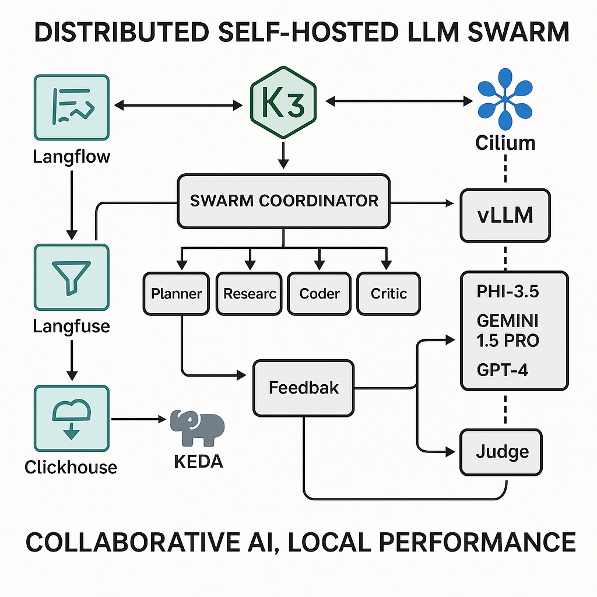

# vllm-local-swarm

**Slogan:**

> "Collaborative AI, Local Performance"

---

## Overview

This project deploys a **fully self-hosted, SPARC-aligned multi-agent LLM swarm** using open-source technologies. It is designed for local-first, scalable, and feedback-driven collaborative AI.

### 🎯 Key Capabilities

* Modular agents (Planner, Researcher, Coder, QA, Critic, Judge)
* Distributed orchestration with Ray (SwarmCoordinator)
* Fast local inference with vLLM (Phi-3.5, Gemini 1.5 Pro)
* Optional fallback to GPT-4.1 via proxy
* Langfuse + ClickHouse + Redis for observability and memory
* Visual agent workflow building via Langflow
* Autoscaling via KEDA
* Optional Web UI via Open WebUI (for user prompts and chat)
* Deployable via Docker Compose or K3s/Helm
* Docs-as-code with Docusaurus v2.0 (Rancher-style architecture docs)

---

## 🔧 Architecture Components

| Component       | Description                                                 |
| --------------- | ----------------------------------------------------------- |
| `Ray`           | Agent orchestration + SwarmCoordinator                      |
| `vLLM`          | Inference engine for serving local models (Phi/Gemini OSS)  |
| `GPT-4.1 Proxy` | Optional HTTP-based fallback to OpenAI                      |
| `Langfuse`      | Observability layer (tracing, scoring, structured logs)     |
| `ClickHouse`    | Long-term structured trace store                            |
| `Redis`         | Fast in-memory short-term state & Langfuse queue            |
| `Qdrant/Chroma` | Vector DB for persistent semantic memory                    |
| `Langflow`      | Visual graph builder for agent workflows                    |
| `Open WebUI`    | Optional web-based interface for user interaction with LLMs |
| `KEDA`          | Autoscaling agent pods based on task load                   |
| `K3s/Cilium`    | Lightweight Kubernetes + secure eBPF networking             |

---
## System Diagram


## 🚀 Deployment Options

### Option A: Docker Compose (Single Node)

```bash
git clone https://github.com/your-org/vllm-local-swarm.git
cd vllm-local-swarm
cp .env.example .env  # add your GPT-4 key if using proxy
make compose-up
```

### Option B: K3s + Helm (Multi-Node)

```bash
# Install K3s & Helm first
helm repo add vllm-swarm https://your-org.github.io/helm-charts
helm install vllm-local-swarm vllm-swarm/agent-stack -f values.yaml
```

---

## 🧠 Memory System

* **Short-Term Memory:** Redis for session context & agent handoffs
* **Long-Term Memory:** ClickHouse for trace logs, Qdrant for semantic recall

---

## 📟 CLI Usage (SPARC-style)

```bash
sparc new "Generate a Python API for task management"
sparc status <task-id>
sparc review <task-id>
sparc self-improve
```

---

## 🤖 Agent Roles

* `Planner`: Task breakdown, coordination
* `Researcher`: Source-aware evidence gathering
* `Coder`: Code generation, refinement
* `QA`: Test execution, validation
* `Critic`: Structural and logical critique
* `Judge`: Scoring, revision suggestion, and completion approval

---

## 🛠️ Auto-Updating

Agents can:

* Rewrite prompt scaffolding
* Modify routing DAGs
* Propose and apply config updates
* Trigger improvement tasks and redeploy

---

## 🔍 Monitoring

* Langfuse Dashboard: `http://localhost:3000`
* VectorDB UI (if enabled): `http://localhost:6333`
* Open WebUI (if enabled): `http://localhost:8080`

---

## 📦 Output Directory Structure

```
.
├── docker-compose.yml
├── helm/
├── cli/
│   └── sparc.py
├── ray/
│   └── coordinator.py
├── models/
│   └── vllm-models/
├── prompts/
│   ├── planner.md
│   └── researcher.md
├── memory/
│   ├── redis/
│   ├── clickhouse/
│   └── vector/
├── ui/
│   └── open-webui/  # optional frontend integration
├── docs/
│   └── docusaurus/  # Docusaurus v2.0 project for architecture docs
└── README.md
```

---

## 🧠 Slogan

> **"Collaborative AI, Local Performance"**

---

## License

MIT License. Attribution encouraged for derivative frameworks.

---

For full setup instructions and documentation, visit:
📖 [https://your-org.github.io/vllm-local-swarm](https://your-org.github.io/vllm-local-swarm)
