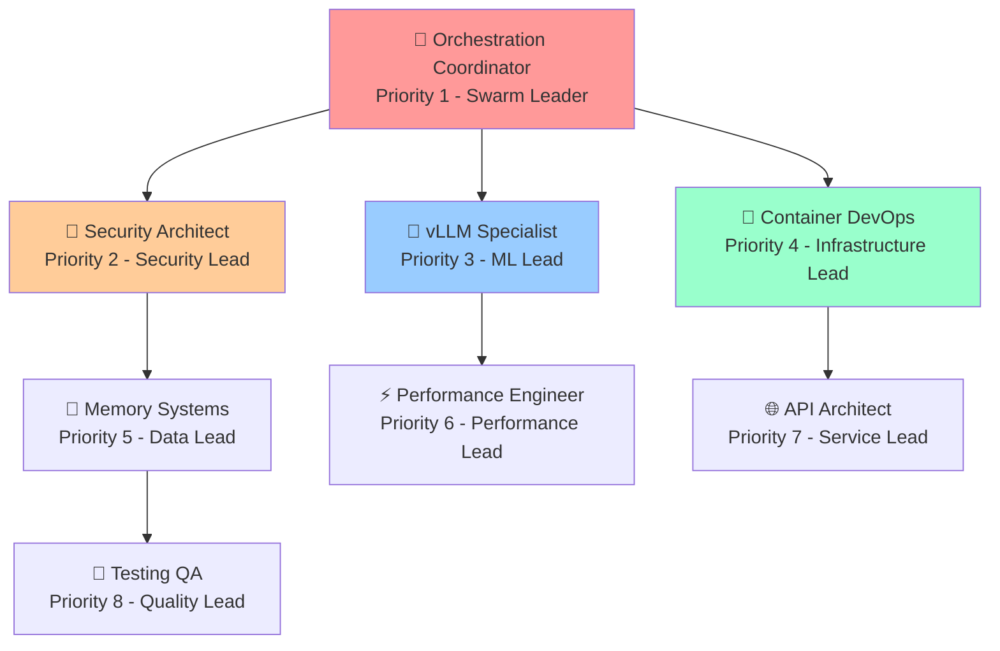

# 🤖 vLLM Enterprise Security Swarm - Development Guide v2.0

## 🎯 **8-Agent Swarm Development Initiative**

**Branch**: `feature/swarm-development-v2`  
**Swarm ID**: `vllm-enterprise-swarm-v2`  
**Status**: Active Development  
**Security Level**: Enterprise  

---

## 🏗️ **Swarm Architecture Overview**

### **🎖️ Agent Hierarchy & Roles**



---

## 🔐 **Agent Specifications**

### **1. 🎯 Orchestration Coordinator (`orchestration-coordinator-001`)**
- **Role**: Swarm Leader & Workflow Coordinator
- **Security Clearance**: Admin (Maximum Audit)
- **Key Capabilities**: 
  - SPARC workflow execution
  - Agent lifecycle management
  - Cross-agent communication
  - Performance monitoring
- **Focus Areas**:
  - Workflow optimization
  - Coordination strategies  
  - Performance patterns

### **2. 🔐 Security Architect (`security-architect-001`)**
- **Role**: Security Lead & Compliance Officer
- **Security Clearance**: Security Admin (Maximum Audit)
- **Key Capabilities**:
  - JWT management
  - RBAC configuration
  - Vulnerability assessment
  - Compliance validation
- **Focus Areas**:
  - Zero-trust architecture
  - Enterprise security
  - Compliance frameworks (GDPR, SOC2, HIPAA)

### **3. 🤖 vLLM Specialist (`vllm-specialist-001`)**
- **Role**: ML Engineering Lead
- **Security Clearance**: ML Engineer (High Audit)
- **Key Capabilities**:
  - Model serving optimization
  - GPU memory management
  - Inference tuning
  - AI workflow integration
- **Focus Areas**:
  - vLLM optimization
  - GPU efficiency
  - Model performance

### **4. 🐳 Container DevOps (`container-devops-001`)**
- **Role**: Infrastructure Lead
- **Security Clearance**: DevOps (High Audit)
- **Key Capabilities**:
  - Docker optimization
  - Kubernetes deployment
  - CI/CD pipeline management
  - GHCR publishing
- **Focus Areas**:
  - Container orchestration
  - Deployment automation
  - Infrastructure patterns

### **5. 💾 Memory Systems (`memory-systems-001`)**
- **Role**: Data Lead
- **Security Clearance**: Data Admin (High Audit)
- **Key Capabilities**:
  - Agent memory management
  - Anti-collision implementation
  - Cache optimization
  - Persistence strategies
- **Focus Areas**:
  - Memory architectures
  - Persistence optimization
  - Coordination efficiency

### **6. ⚡ Performance Engineer (`performance-engineer-001`)**
- **Role**: Performance Optimization Lead
- **Security Clearance**: Engineer (Medium Audit)
- **Key Capabilities**:
  - Load testing
  - Bottleneck detection
  - Scalability assessment
  - Cost optimization
- **Focus Areas**:
  - Performance optimization
  - Scalability patterns
  - Resource efficiency

### **7. 🌐 API Architect (`api-architect-001`)**
- **Role**: Service Architecture Lead
- **Security Clearance**: Architect (Medium Audit)
- **Key Capabilities**:
  - FastAPI design
  - Microservices coordination
  - API security design
  - Service integration
- **Focus Areas**:
  - API design patterns
  - Service architectures
  - Integration strategies

### **8. 🧪 Testing QA (`testing-qa-001`)**
- **Role**: Quality Assurance Lead
- **Security Clearance**: QA Security (Maximum Audit)
- **Key Capabilities**:
  - London TDD enforcement
  - 100% coverage validation
  - Security testing
  - Quality metrics
- **Focus Areas**:
  - Testing strategies
  - Security validation
  - Quality enforcement

---

## 🔄 **Development Coordination Protocols**

### **Communication Patterns**
- **Hierarchical**: Coordinator → Agents (structured workflows)
- **Peer-to-Peer**: Direct collaboration between specialized agents
- **Broadcast**: System-wide announcements and updates

### **Anti-Collision System**
- **Task Hash Tracking**: Prevents duplicate work
- **Agent History**: Complete task assignment tracking
- **LRU Fallback**: Intelligent agent selection when all have handled similar tasks
- **Max Retries**: 3 attempts before escalation

### **Memory Coordination**
- **Strategy**: Eventual consistency with real-time backup
- **Encryption**: All memory operations encrypted
- **Persistence**: PostgreSQL-backed with audit trails

---

## 🛡️ **Enterprise Security Framework**

### **Zero-Trust Architecture**
- All communications authenticated and authorized
- Every action logged and auditable
- RBAC enforced at all levels
- Continuous security scanning

### **Compliance Standards**
- **GDPR**: Data protection and privacy
- **SOC2**: Security and availability controls
- **HIPAA**: Healthcare data protection
- **Audit Retention**: 7-year storage requirement

---

## 📊 **Performance Targets**

### **Response Time SLAs**
- **Orchestration**: < 2 seconds
- **Security Operations**: < 5 seconds  
- **vLLM Operations**: < 10 seconds
- **Memory Operations**: < 3 seconds

### **Concurrency Limits**
- **Orchestration**: 10 concurrent workflows
- **Security Scanning**: 5 concurrent assessments
- **Memory Operations**: 20 concurrent transactions
- **Testing**: 8 concurrent test suites

---

## 🚀 **Development Priorities**

### **Phase 1: Foundation Enhancement**
1. **Security Architect**: Implement advanced authentication patterns
2. **Memory Systems**: Optimize agent memory persistence
3. **Testing QA**: Enforce London TDD across all components

### **Phase 2: Performance Optimization**
1. **vLLM Specialist**: GPU optimization and model serving improvements
2. **Performance Engineer**: Bottleneck analysis and optimization
3. **Container DevOps**: CI/CD pipeline enhancements

### **Phase 3: Integration & Scaling**
1. **API Architect**: Service mesh implementation
2. **Orchestration Coordinator**: Advanced workflow patterns
3. **All Agents**: Enterprise-grade observability

---

## 🔧 **Development Commands**

### **Swarm Initialization**
```bash
# Load swarm configuration
cat swarm-config.json

# Verify agent assignments
git checkout feature/swarm-development-v2
git status

# Check CI/CD status
gh workflow list
```

### **Agent Coordination**
```bash
# Each agent focuses on their specialization
# Orchestration Coordinator manages overall workflow
# Security Architect ensures all changes are secure
# Testing QA validates with 100% coverage requirement
```

### **Security Protocols**
```bash
# All commits must pass security validation
# All code changes require security review
# All deployments require compliance checking
```

---

## 📈 **Success Metrics**

### **Technical KPIs**
- **Code Quality**: 100% test coverage maintained
- **Security**: Zero vulnerabilities in production
- **Performance**: All SLAs met consistently
- **Reliability**: 99.9% uptime target

### **Development KPIs** 
- **Velocity**: Consistent feature delivery
- **Quality**: Reduced bug rates
- **Security**: Proactive threat mitigation
- **Innovation**: Advanced AI capabilities

---

## 🎯 **Next Steps for 8-Agent Swarm**

1. **Immediate**: Begin specialized development tasks per agent role
2. **Short-term**: Implement advanced coordination patterns
3. **Medium-term**: Deploy enterprise-grade observability
4. **Long-term**: Achieve fully autonomous AI platform operation

---

**🤖 vLLM Enterprise Security Swarm v2.0 - Ready for Development**

*This 8-agent swarm represents the pinnacle of enterprise AI platform development with security-first architecture, comprehensive coordination, and specialized agent roles optimized for the vLLM Local Swarm ecosystem.*